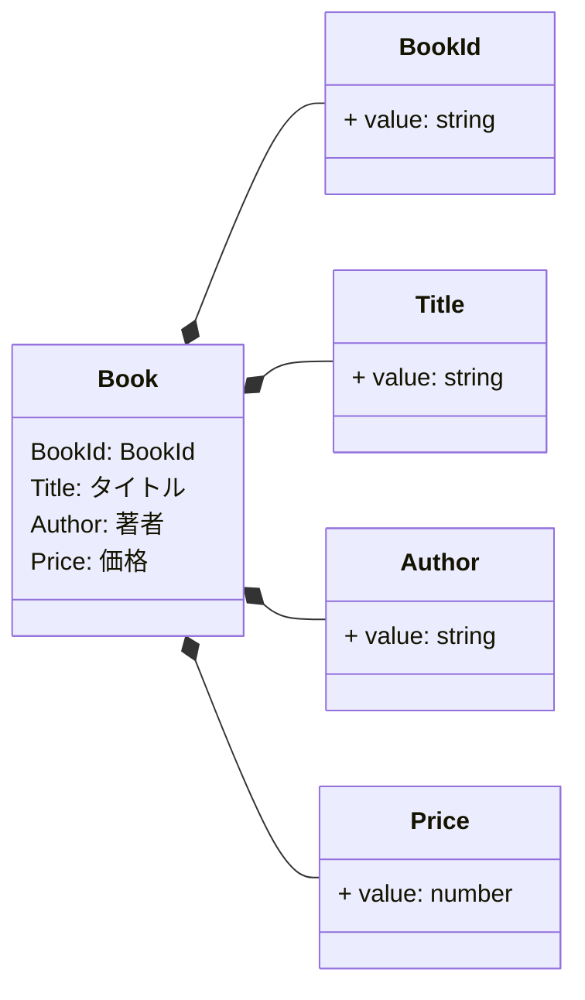

## BookId
- ISBNコードを適用する。
- ISBNコードは、ISBNのあとに数字で「978」、
- さらにグループ（国・地域）番号（日本は4）、出版社番号、書名番号、の合計12桁の数字を並べ、
- 最後にこの12桁の数字を特定の計算式で演算して得た1桁のチェック用の数を付け加えたコード。

## Title
```ts
MAX_LENGTH = 1000
MIN_LENGTH = 1
```

## Author
```ts
MAX_LENGTH = 100
MIN_LENGTH = 1
```

## Price
```ts
// 日本円のみ扱う。
MAX = 1000000
MIN = 1
```