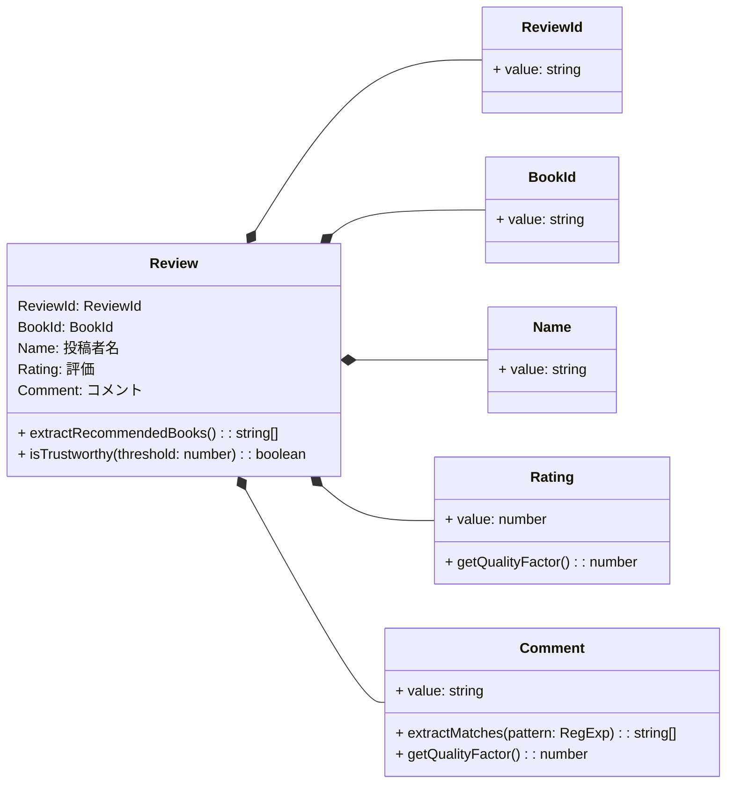

```mermaid
classDiagram
    direction LR

    class Review {
        ReviewId: ReviewId
        BookId: BookId
        Name: 投稿者名
        Rating: 評価
        Comment: コメント
        + extractRecommendedBooks(): string[]
        + isTrustworthy(threshold: number): boolean
    }

    class ReviewId {
        + value: string
    }

    class BookId {
        + value: string
    }

    class Name {
        + value: string
    }

    class Rating {
        + value: number
        + getQualityFactor(): number
    }

    class Comment {
        + value: string
        + extractMatches(pattern: RegExp): string[]
        + getQualityFactor(): number
    }

    Review *-- ReviewId
    Review *-- BookId
    Review *-- Name
    Review *-- Rating
    Review *-- Comment
```